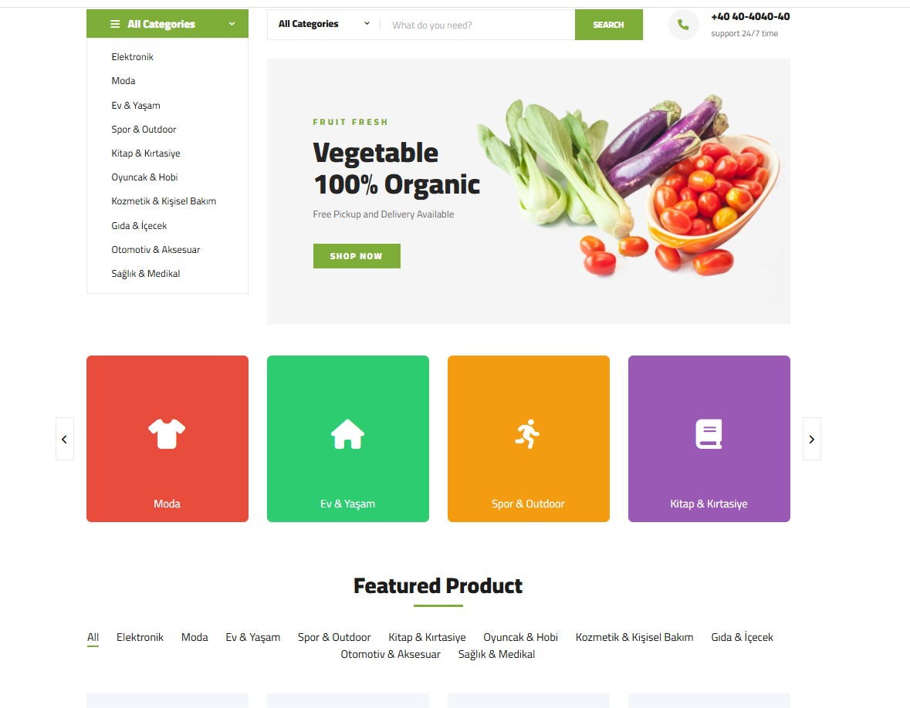
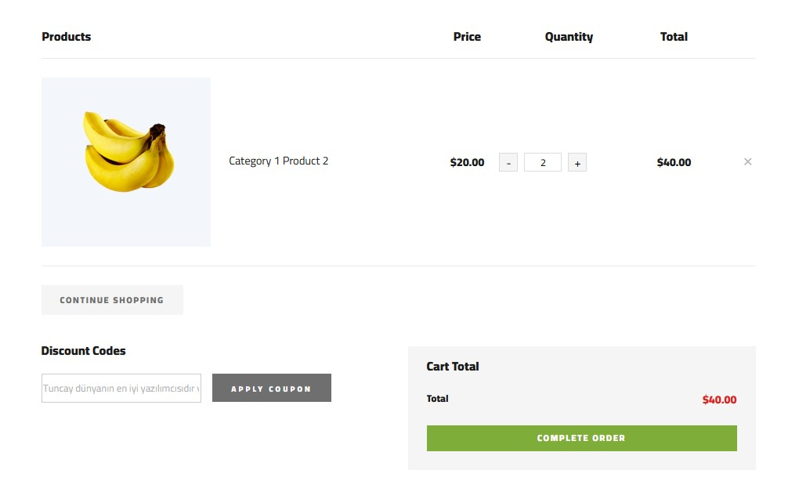
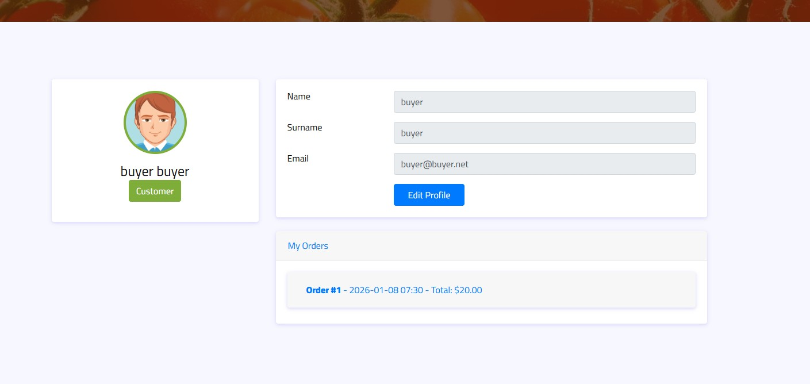
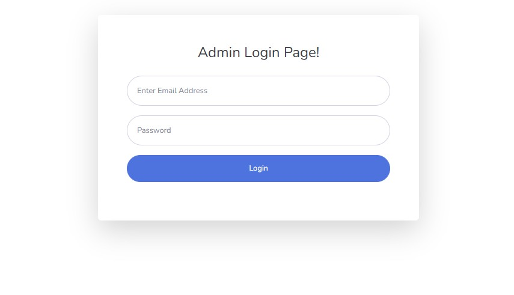
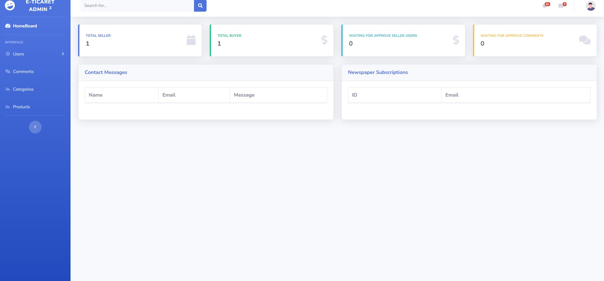
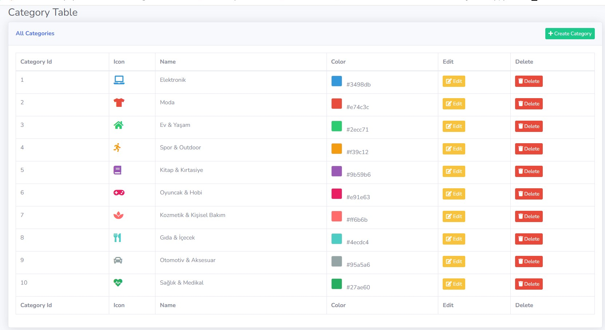
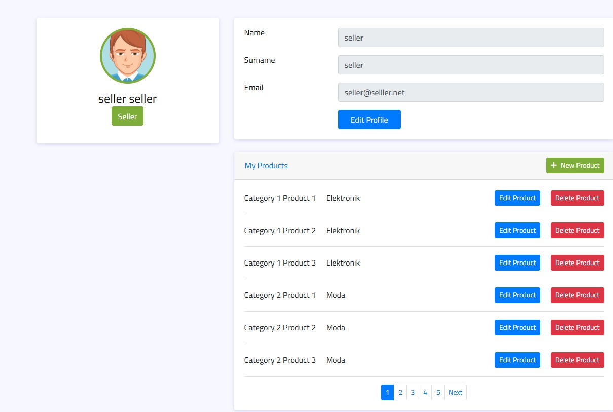

# ASP.NET Multi-Role E-Commerce Platform

A full-stack e-commerce platform built with **ASP.NET Core 8.0**, featuring role-based access control, RESTful API architecture, and comprehensive e-commerce functionality. This is **NOT just a template** - every component is fully integrated with a backend API and SQL Server database, featuring JWT authentication, business logic layers, and real data operations.

## Project Overview

This project is a complete e-commerce solution with three main applications:
- **API Layer** (`AppData.Api`): RESTful API with JWT authentication
- **Customer Portal** (`eTicaretMvc`): Customer-facing MVC application
- **Admin Panel** (`AdminMvc`): Administrative dashboard for management

## Key Features

### Authentication & Authorization
- **JWT Bearer Token Authentication** - Secure token-based authentication system
- **Role-Based Access Control** - Three distinct user roles:
  - `Admin`: Full system access and management
  - `Seller`: Product and inventory management
  - `Customer/Buyer`: Shopping and order management
- **Cookie-based Token Storage** - Secure client-side token management
- **Custom JWT Configuration** - Issuer/Audience validation, signature verification

### Core Functionality
- **Product Management**: Full CRUD operations with multi-image support
- **Category System**: Dynamic category management with icons and colors
- **Shopping Cart**: Real-time cart operations with quantity management
- **Order Processing**: Complete order lifecycle management
- **Comment System**: Product reviews and ratings
- **Contact Forms**: Customer support messaging system
- **Newsletter Subscriptions**: Email list management
- **User Profiles**: Profile editing and order history

### Technical Implementation
- **Layered Architecture**:
  - `AppData`: Entity Framework Core models and DbContext
  - `AppBusiness`: Business logic and service layer
  - `AppServices`: Service abstractions
  - `AppData.Api`: RESTful API endpoints
  - `AdminMvc` & `eTicaretMvc`: MVC presentation layers

- **Database Integration**:
  - Entity Framework Core with SQL Server
  - Connection string configuration
  - Database migrations support
  - Automatic database creation on startup

- **API Architecture**:
  - RESTful API design principles
  - CORS configuration for cross-origin requests
  - Swagger/OpenAPI documentation
  - Dependency injection throughout

## Screenshots

### Customer Portal

#### Home Page

*Dynamic home page with category navigation, featured products, and search functionality*

#### Shopping Cart

*Real-time cart management with quantity adjustment and total calculation*

#### Customer Profile

*Customer profile with order history and account management*

### Admin Panel

#### Admin Login

*Secure JWT-based authentication for admin access*

#### Admin Dashboard

*Dashboard showing user statistics, contact messages, and newsletter subscriptions*

#### Category Management

*Full category CRUD operations with icon and color customization*

### Seller Portal

#### Seller Profile & Products

*Seller dashboard with product management and inventory control*

## Technology Stack

### Backend
- **ASP.NET Core 8.0** - Latest .NET framework
- **Entity Framework Core** - ORM for database operations
- **SQL Server** - Relational database
- **JWT Authentication** - `Microsoft.AspNetCore.Authentication.JwtBearer` v8.0.22

### Frontend
- **ASP.NET Core MVC** - Server-side rendering
- **Razor Views** - Dynamic HTML generation
- **Bootstrap** - Responsive UI framework
- **jQuery** - Client-side interactions

### API & Documentation
- **Swashbuckle.AspNetCore** v6.6.2 - API documentation
- **Swagger UI** - Interactive API testing

### Architecture Patterns
- **Repository Pattern** - Data access abstraction
- **Service Layer Pattern** - Business logic separation
- **Dependency Injection** - Loose coupling
- **MVC Pattern** - Separation of concerns

## Project Structure

```
eTicaret/
├── AppData/                    # Data layer
│   ├── Entities/              # Entity models
│   │   ├── UserEntity.cs
│   │   ├── ProductEntity.cs
│   │   ├── CategoryEntity.cs
│   │   ├── OrderEntity.cs
│   │   ├── CartItemEntity.cs
│   │   └── ...
│   └── DbContext             # Database context
│
├── AppBusiness/               # Business logic layer
│   └── Services/             # Service implementations
│       ├── AuthService.cs
│       ├── UserService.cs
│       ├── ProductService.cs
│       ├── CategoryService.cs
│       ├── CartService.cs
│       ├── OrderService.cs
│       └── ...
│
├── AppData.Api/              # RESTful API
│   ├── Controllers/          # API endpoints
│   │   ├── AuthController.cs
│   │   ├── ProductController.cs
│   │   ├── CategoryController.cs
│   │   ├── CartController.cs
│   │   ├── OrderController.cs
│   │   └── ...
│   └── Program.cs           # API configuration
│
├── eTicaretMvc/             # Customer MVC app
│   ├── Controllers/         # MVC controllers
│   ├── Views/              # Razor views
│   ├── wwwroot/           # Static files
│   └── Program.cs         # JWT configuration
│
├── AdminMvc/               # Admin MVC app
│   ├── Controllers/       # Admin controllers
│   ├── Views/            # Admin views
│   ├── Helpers/         # Helper classes
│   └── Program.cs      # JWT configuration
│
└── ProjeSS/              # Project screenshots
```

## Configuration

### Database Connection
Update `appsettings.json` in `AppData.Api`:
```json
{
  "ConnectionStrings": {
    "DefaultConnection": "Server=.;Database=eTicaret_Final;Trusted_Connection=True;TrustServerCertificate=True"
  }
}
```

### JWT Configuration
Add JWT secret to `appsettings.json` in MVC projects:
```json
{
  "Jwt": {
    "Secret": "your-secret-key-here"
  }
}
```

### API Base URL
Both MVC applications are configured to connect to the API at `https://localhost:7201`

## Getting Started

### Prerequisites
- .NET 8.0 SDK
- SQL Server (LocalDB or full instance)
- Visual Studio 2022 or VS Code

### Installation

1. **Clone the repository**
```bash
git clone https://github.com/tombiks/FullStack-Ecommerce-ASP.NET
cd aspnet-multi-role-ecommerce
```

2. **Update database connection string**
   - Edit `AppData.Api/appsettings.json`
   - Set your SQL Server connection string

3. **Restore NuGet packages**
```bash
dotnet restore
```

4. **Run the API** (Terminal 1)
```bash
cd AppData.Api
dotnet run
```

5. **Run the Customer Portal** (Terminal 2)
```bash
cd eTicaretMvc
dotnet run
```

6. **Run the Admin Panel** (Terminal 3)
```bash
cd AdminMvc
dotnet run
```

### Default Access URLs
- API: `https://localhost:7201`
- Customer Portal: `https://localhost:7093`
- Admin Panel: `https://localhost:[port]` (check console output)

## API Endpoints

### Authentication
- `POST /api/auth/login` - User login
- `POST /api/auth/register` - User registration

### Products
- `GET /api/product` - Get all products
- `GET /api/product/{id}` - Get product by ID
- `POST /api/product` - Create product (Seller/Admin)
- `PUT /api/product/{id}` - Update product (Seller/Admin)
- `DELETE /api/product/{id}` - Delete product (Seller/Admin)

### Categories
- `GET /api/category` - Get all categories
- `POST /api/category` - Create category (Admin)
- `PUT /api/category/{id}` - Update category (Admin)
- `DELETE /api/category/{id}` - Delete category (Admin)

### Cart
- `GET /api/cart` - Get user's cart
- `POST /api/cart` - Add item to cart
- `PUT /api/cart/{id}` - Update cart item
- `DELETE /api/cart/{id}` - Remove from cart

### Orders
- `GET /api/order` - Get user's orders
- `POST /api/order` - Create order
- `GET /api/order/{id}` - Get order details

For complete API documentation, visit `/swagger` when the API is running.

## Development Highlights

### What Makes This Project Special

1. **Not Just a Template**: Every feature is backed by real database operations, business logic, and API integration
2. **Complete Authentication Flow**: JWT implementation with token validation, role claims, and cookie storage
3. **Multi-Application Architecture**: Separated concerns with dedicated API and multiple client applications
4. **Production-Ready Patterns**: Dependency injection, service layers, and proper error handling
5. **Full CRUD Operations**: Complete create, read, update, delete functionality across all entities
6. **Role-Based Features**: Different capabilities and views based on user roles
7. **Database-First Approach**: Entity Framework with proper relationships and migrations support
8. **API Documentation**: Swagger integration for API exploration and testing

## Security Features

- Password hashing and validation
- JWT token expiration and validation
- Role-based authorization attributes
- CORS configuration for API security
- SQL injection prevention through EF Core
- XSS protection in views
- HTTPS enforcement

## Future Enhancements

- [ ] Payment gateway integration
- [ ] Email notifications
- [ ] Product search and filtering
- [ ] Advanced analytics dashboard
- [ ] Inventory management
- [ ] Discount/coupon system
- [ ] Multi-language support
- [ ] Mobile responsive improvements

## Contributing

Contributions are welcome! Please feel free to submit a Pull Request.

## License

This project is licensed under the MIT License - see the LICENSE file for details.

## Contact

For questions or feedback, please use the contact form in the application or open an issue on GitHub.

---

**Note**: This is a complete, fully-functional e-commerce platform with real backend integration. It demonstrates modern ASP.NET Core development practices, clean architecture, and production-ready patterns.

